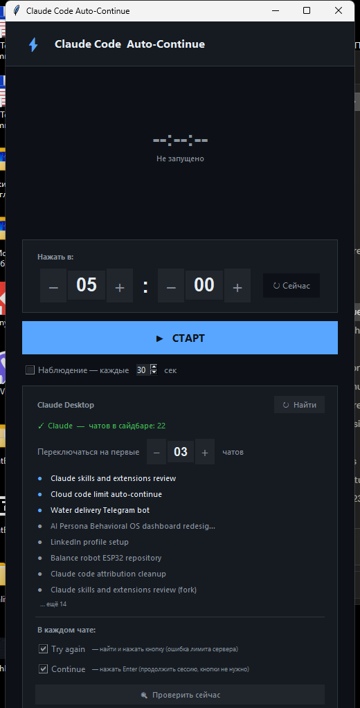
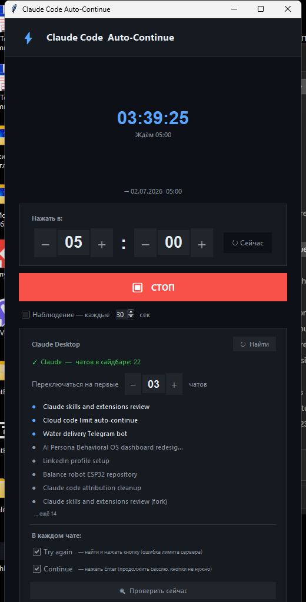

<div align="center">

[English](README_EN.md) • **Русский**

</div>

# ⚡ Claude Code Auto-Continue

Автоматически находит и нажимает кнопку **Try again** в Claude Desktop по расписанию — когда сервер временно ограничивает запросы (rate limit). Умеет переключаться между несколькими чатами в сайдбаре одного окна и нажимать **Enter**, чтобы продолжить сессию, которая просто ждёт ввода после исчерпания лимита.

Кнопка ищется через **UI Automation по тексту**, без ручного захвата шаблона. Electron-приложения часто не проставляют элементам правильную ARIA-роль (`ControlType=Button`), поэтому поиск идёт по видимому тексту (`Name`) на любом типе элемента — с приоритетом точного совпадения и фильтром по минимальному размеру, чтобы не зацепить случайную мелкую иконку.

<div align="center">


</div>

---

## Возможности

- **Расписание** — сработать в точное время (например, когда лимиты сбрасываются ночью)
- **Автопоиск кнопки** — без ручного захвата шаблона; ищет «Try again» по тексту через UI Automation
- **Переключение между чатами в сайдбаре** — заходит в первые N чатов из списка и обрабатывает каждый (сортировка сверху-вниз, как в интерфейсе)
- **Два независимых действия на чат:**
  - `Try again` — находит и кликает реальную кнопку (ошибка временного ограничения сервера)
  - `Continue` — нажимает **Enter** после захода в чат, независимо от того, нашлась ли кнопка (обычно после лимита Claude Code просто ждёт ввода, без всякой кнопки)
- **Режим наблюдения** — повторяет проверку каждые N секунд
- **Резервный вариант** — если авто-поиск не находит кнопку (редкий случай/другая версия приложения), можно один раз захватить шаблон кнопки по скриншоту
- Настоящее управление мышью (движение + клик), не симуляция через SendKeys
- Кольцевой таймер обратного отсчёта, тёмная GitHub-тема

---

## Установка

```bash
pip install -r requirements.txt
```

`pyautogui`, `pillow`, `uiautomation` — обязательны. `opencv-python-headless` — только для резервного варианта (поиск по шаблону с допуском).

## Запуск

```bash
python claude_continue_gui.py
```

Или через `run.bat` (показывает консоль с ошибками, если что-то пошло не так).

Ярлык на рабочем столе использует `pythonw.exe` — открывается без консольного окна.

---

## Как пользоваться

1. Открой Claude Desktop, нажми **«🔍 Найти»** в приложении — покажет найденное окно и список чатов в сайдбаре.
2. Выбери, сколько первых чатов проверять («Переключаться на первые N чатов»).
3. Отметь нужные действия — `Try again` и/или `Continue` (можно оба сразу).
4. Нажми **«🔍 Проверить сейчас»**, чтобы протестировать поиск кнопки Try again без переключения чатов и без нажатия Enter.
5. Выставь время и нажми **СТАРТ**.
6. В нужный момент программа выводит окно Claude на передний план, по очереди заходит в выбранные чаты и выполняет отмеченные действия в каждом.

---

## Как это работает технически

- `find_claude_windows` — находит окно процесса `Claude.exe` (официальное приложение), отличая его от CLI `claude-code`.
- `find_sidebar_chats` — находит навигационный сайдбар по геометрии (не по имени — в дереве бывает несколько узлов `"Sidebar"`, например у панелей файлов внутри code-артефактов), затем собирает кнопки-чаты, отфильтровывая обвязку интерфейса (Pinned/Recents/More options/Relaunch to update и т.п.).
- `find_button_uia` — обходит дерево в обратном порядке детей (последние элементы — обычно низ чата, где и появляется кнопка), ищет точное совпадение по тексту в приоритете, substring — только как запасной вариант с фильтром по размеру.
- `bring_to_foreground` — перед кликами выводит окно Claude на передний план через `AttachThreadInput` (обычный `SetForegroundWindow` из фонового процесса Windows часто молча игнорирует — окно может остаться перекрытым, например, окном видеозвонка, и клик попадёт не туда).
- `find_message_input` — перед отправкой Enter кликает в поле ввода сообщения (контейнер `"Prompt"`, тоже кастомный редактор без стандартной роли Edit). Без этого фокус остаётся на кнопке чата в сайдбаре, и Enter улетает в никуда.

---

## Известные ограничения

- Если окно Claude перекрыто модальным просмотрщиком (PDF/полноэкранный артефакт) или другим окном поверх, и `bring_to_foreground` не срабатывает — клик может попасть не в то место. Программа логирует предупреждение в этом случае.
- Резервный поиск по шаблону чувствителен к масштабу/теме интерфейса — если пользуешься им, обнови шаблон при смене темы или масштабирования экрана.
- `Continue` жмёт Enter «вслепую» — если в поле ввода чата уже что-то напечатано вручную, это будет отправлено.

## Системные требования

- Windows 10/11
- Python 3.9+

---

## Документация

- [CHANGELOG.md](CHANGELOG.md) — история версий
- [CONTRIBUTING.md](CONTRIBUTING.md) — как внести вклад
- [CODE_OF_CONDUCT.md](CODE_OF_CONDUCT.md) — правила поведения
- [RELEASE_INFO.md](RELEASE_INFO.md) — установка релиза
- [LICENSE.md](LICENSE.md) — лицензия MIT
