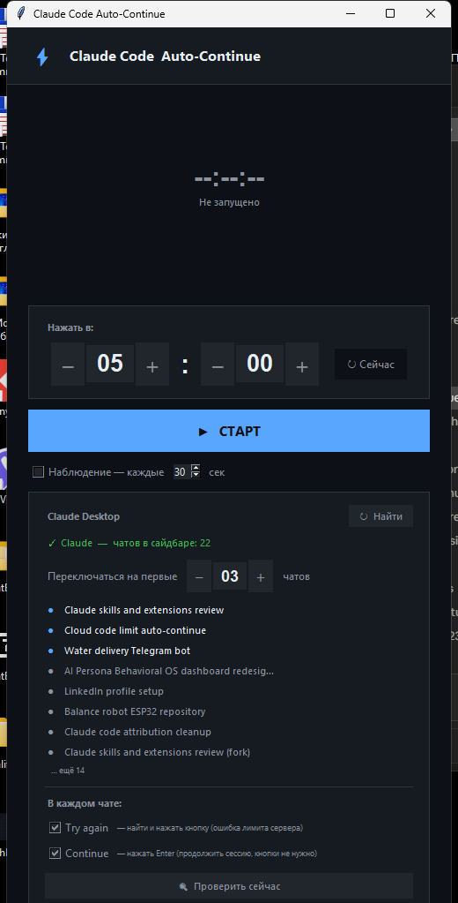
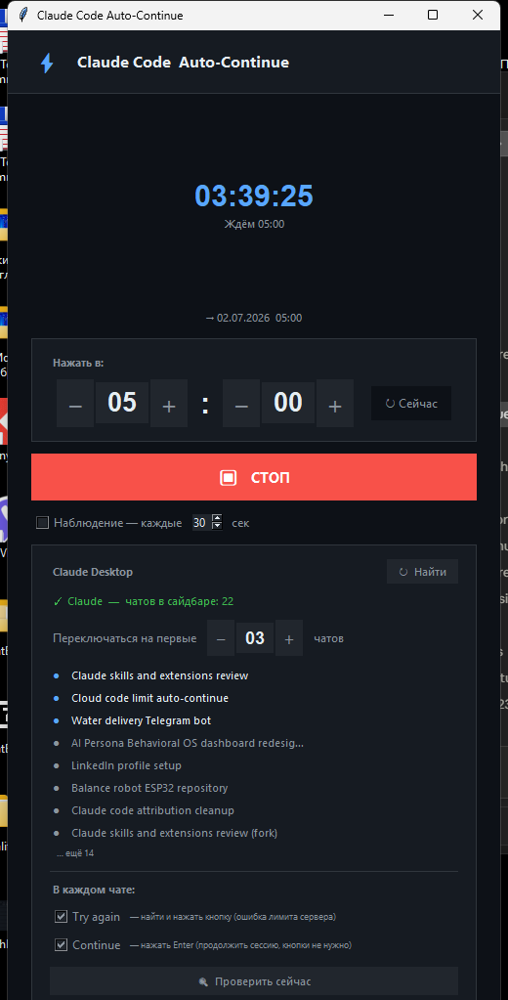

<div align="center">

[English](README_EN.md) • **Русский**

</div>

# Electron Auto-Continue

<p align="center">
  <a href="https://github.com/Mukller">
    
  </a>
</p>

> [!NOTE]
> Ранее проект назывался **claude-auto-continue** и работал только с Claude Desktop.
> Теперь движок отвязан от конкретного приложения: Claude работает из коробки,
> Cursor / Windsurf / Copilot Chat — экспериментальные профили.

Универсальный авто-resume для Electron AI-чатов: автоматически находит кнопку
**Try again / Retry / Resume**, когда сервер ограничивает запросы (rate limit),
и нажимает **Enter**, чтобы продолжить зависшую сессию. Срабатывает по расписанию,
умеет переключаться между чатами в сайдбаре одного окна.

Поиск кнопки — через **UI Automation по тексту** (Windows) или **скриншот-шаблоны**
(macOS). Electron-приложения часто не проставляют элементам правильные ARIA-роли,
поэтому поиск идёт по видимому тексту на любом типе элемента.

[](screenshots/app-idle.png)
[](screenshots/app-running.png)

---

## Возможности

- **Профили приложений** — Claude Desktop из коробки; Cursor / Windsurf /
  Copilot Chat как экспериментальные пресеты. Профиль = exe процесса +
  лейблы кнопок повтора + имена поля ввода + словари навигации сайдбара
- **Расписание** — сработать в точное время (например, когда сбрасываются ночные лимиты)
- **План запусков (циклы)** — несколько времён, ежедневный повтор или разовые запуски
- **Два действия на чат:** `Try again` — клик по реальной кнопке; `Continue` — Enter после захода в чат (с защитой черновика: если в поле ввода есть текст, Enter не отправляется)
- **Режим наблюдения** — повторять проверку каждые N секунд
- **Трекер лимита** — читает время сброса из сообщения Claude и сам добавляет его в план
- **Резервный поиск по скриншоту** — захват шаблона кнопки мышью
- **CLI/headless** — ночные прогоны без окна, лог в файл
- Тёмная/светлая тема, системный трей, уведомления, автозапуск, статистика и история срабатываний
- **macOS**: переключение чатов сайдбара через Accessibility API (выдайте разрешение при первом запросе); без pyobjc — работа с текущим чатом

## Установка

```bash
pip install -r requirements.txt
```

**Windows:** `pyautogui`, `pillow`, `uiautomation` — обязательны.
**macOS:** `pyautogui`, `pillow`; `uiautomation` не нужен.
`opencv-python-headless` — только для резервного варианта (поиск по шаблону).

## Запуск GUI

```bash
python claude_continue_gui.py
```

Или через `run.bat` (Windows). Кнопка **«Приложение: …»** в карточке окна листает
профили по кругу; после смены профиля нажмите **«↻ Найти»** для рескана.

### CLI / headless (без окна)

```bash
python claude_continue_gui.py --headless --at 05:00                  # сработать в 05:00
python claude_continue_gui.py --headless --now --profile cursor      # цикл для Cursor сразу
python claude_continue_gui.py --list-profiles                        # список профилей
```

Флаги: `--once`, `--interval SEC`, `--chats N`, `--no-try-again`, `--no-continue`,
`--confidence`, `--log-file PATH`. Полный список: `--help`.

### Сборка exe

Пуш тега `v*` собирает one-file `ClaudeAutoContinue.exe` через PyInstaller
(`.github/workflows/release.yml`) и прикладывает к релизу.

## Профили

| Профиль | Приложение | Статус | Процесс |
|---|---|---|---|
| `claude` | Claude Desktop | эталон | `claude.exe` |
| `cursor` | Cursor | экспериментальный | `cursor.exe` |
| `windsurf` | Windsurf | экспериментальный | `windsurf.exe` |
| `copilot` | VS Code Copilot Chat | экспериментальный | `code.exe` + заголовок окна |

Экспериментальные профили — best-effort пресеты: дерево UIA каждого приложения
не сверялось поэлементно, лейблы кнопок зависят от версии и языка интерфейса.
Если профиль промахивается — поправьте `APP_PROFILES` в `engine.py` под себя
и пришлите PR.

### Тонкая настройка профилей

Любое поле профиля можно переопределить в `settings.json` без правки кода:

```json
{
  "profile": "cursor",
  "profile_overrides": {
    "cursor": { "button_labels": ["Ещё раз", "Retry"] }
  }
}
```

Применяются только существующие ключи профиля (`button_labels`,
`input_names`, `process`, `sidebar_chrome`, ...); опечатки игнорируются.

## Известные ограничения

- Если окно приложения перекрыто и `bring_to_foreground` не сработал, клик может попасть не туда — программа пишет предупреждение в лог
- Резервный поиск по шаблону чувствителен к масштабу/теме — переснимайте шаблон при смене темы или DPI
- Экспериментальные профили: названия элементов UI меняются между версиями приложений

## Аварийный стоп

Резкий вынос мыши в **угол экрана** (FAILSAFE) немедленно прерывает идущий цикл — клики останавливаются, в лог пишется запись об аварийном стопе.

## Документация

- [CHANGELOG.md](CHANGELOG.md) — история версий
- [CONTRIBUTING.md](CONTRIBUTING.md) — как внести вклад
- [CODE_OF_CONDUCT.md](CODE_OF_CONDUCT.md) — правила поведения
- [RELEASE_INFO.md](RELEASE_INFO.md) — установка релиза
- [LICENSE.md](LICENSE.md) — лицензия MIT
